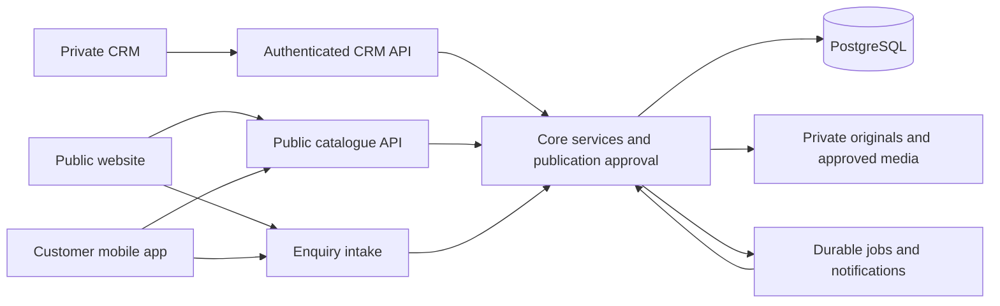

# CRM, website and mobile platform design

This is the proposed production system design for Keys with Simoni. The existing CRM is a browser-local frontend prototype; this document defines the next platform rather than claiming those services are implemented.

Confirmed product decision: **Super Admin approval is required before a property listing appears on the public website or mobile app.**

Working assumptions: one agency, privately owned member CRM workspaces, and a customer-facing mobile app. Staff continue to use the CRM. External agencies, delegated access to another member's workspace and a dedicated staff mobile app would require additional product decisions.

## One platform, three applications

Use one shared backend with focused modules, a PostgreSQL database, object storage/CDN and a durable worker. The CRM, public website and customer mobile app have different interfaces and permissions but share authoritative property and publication services.

The public catalogue API returns approved listing projections. It does not return private CRM records with fields hidden in the browser. The same backend can expose these separately authorized contracts without splitting the initial product into many microservices.

| Part                  | Responsibility                                                                                                          |
| --------------------- | ----------------------------------------------------------------------------------------------------------------------- |
| Private CRM           | Property drafts, media, approval requests, leads, contacts, follow-ups, viewings, deals, finance and scoped activity    |
| Public website        | Search, property details, approved agent profiles, contact buttons and guest enquiries                                  |
| Customer mobile app   | The same catalogue and enquiry flow, with native navigation, saved properties and optional later notifications          |
| Identity and access   | Real staff authentication, active-member checks, roles, workspace authorization and optional separate customer accounts |
| Core API modules      | Private CRM commands, publication validation, public catalogue reads and enquiry routing                                |
| PostgreSQL            | Scoped records, listing revisions, active publications, enquiries, audit events and durable job/outbox state            |
| Media storage and CDN | Protected originals, validated image/floor-plan processing and approved public derivatives                              |
| Background worker     | Image processing, retryable notifications, public-cache invalidation, expiry and future provider events                 |
| Operations            | Automated checks, environments, secrets, monitoring, database backups, restore verification and rollback                |

Keep the backend modular: identity/workspaces; relationships; private properties; schedules; deals/finance; publications; media; enquiries; notifications; audit. HTTP requests handle validation and durable writes; slow or failure-prone external work runs after those writes through jobs.

## Ownership and visibility

| Identity               | Meaning                                                                                      |
| ---------------------- | -------------------------------------------------------------------------------------------- |
| Workspace owner        | Member whose private CRM owns the property, leads and linked records                         |
| Actor / creator        | Authenticated person performing an action, including Super Admin acting in another workspace |
| Landlord / legal owner | Private property contact; not automatically the public agent                                 |
| Public listing agent   | Approved professional profile displayed to customers                                         |
| Enquiry assignee       | Person responsible for responding within the authorized destination workspace                |

For the first release, default the public listing agent and enquiry assignee to the workspace owner, with an eligible approved public profile. Showing another agent must not silently grant that person access to the owner's private records.

Admin A can manage only A's private workspace. Admin B can manage only B's. Super Admin can inspect and manage all workspaces with actions attributed to the actual actor. Both admins may see each other's intentionally published listings as public visitors; that does not expose their underlying CRM data.

Enforce workspace access on every server read/write, linked record, report, export, upload and download. Treat user-supplied workspace or record IDs as untrusted selectors requiring authorization. These requirements address the object-access risks described by [OWASP](https://api-security.owasp.org/editions/2023/en/0xa1-broken-object-level-authorization/).

Use globally unique server IDs and explicit workspace ownership. Keep existing workbook IDs as scoped legacy identifiers because they can repeat across current profiles. Preserve the organisation workspace and independently generated personal records during migration.

## Private records and public listing data

Maintain a private property record and separate public listing revisions. The publication points to one approved revision, with a stable public listing ID and URL across updates.

Public fields should be an explicit allowlist: title, description, purpose/type, approved location detail, price/currency/price basis, readiness, bedrooms/bathrooms/area, amenities, selected media and the approved agent profile/contact version. Decide which permit/licence details and location precision may be public before implementation.

Keep landlord/contact IDs, unit/access instructions, internal notes, original documents, private pricing/finance, client information and staff authentication/access fields private. Existing Properties contains both public-looking and sensitive fields, including a mixed `Photos / documents URL`; importing or serializing that record wholesale is unsafe. Separate public agent profiles from team-member objects, login emails and personal contact details. Approve professional contact details intended for publication.

Server serializers and update commands must allow only the intended fields. Approval, owner and publication fields are server-controlled, consistent with [OWASP property-level authorization guidance](https://api-security.owasp.org/editions/2023/en/0xa3-broken-object-property-level-authorization/).

## Publication and Super Admin approval

1. **Draft:** an admin edits the private property and prepares its public presentation.
2. **Submit:** validation freezes an immutable revision, including exact public fields, processed media versions and public agent/contact version.
3. **Review:** Super Admin sees a preview and change summary, then approves or rejects that revision with a reason.
4. **Publish:** the backend checks approval, ownership, active agent, current availability and applicable authorization/expiry rules, then activates that exact revision.
5. **Update:** changed public fields, media or agent/contact presentation require a new revision and approval.
6. **Withdraw:** the owner can withdraw their own listing promptly; Super Admin can withdraw or suspend any listing. Unavailable or ineligible listings stop accepting enquiries and are removed from the active catalogue.

Approval belongs to the frozen version, not merely the property ID. Editing a CRM record, shared agent profile or image object must not alter an already approved public version. Publication state is separate from business status such as Available, Reserved, Sold or Rented.

Recommended replacement policy: ordinary draft improvements may leave the previous approved version live while it remains accurate and eligible. Materially inaccurate price, availability or contact changes should withdraw the old version until a correct revision is approved. Define those rules explicitly before implementing; approval of a new version must never revive a withdrawn, expired or suspended listing by accident.

The CRM needs a publication section with Draft, Awaiting approval, Rejected, Published and Withdrawn views, preview links, review feedback and public-channel status. Super Admin needs a scoped approval queue. These are future controls, distinct from the existing property availability filters.

## Public website and mobile experience

The website should have a useful home/search page, searchable results, property detail pages, approved agent profiles, and company/contact/privacy information. Search should support purpose, emirate/community, property type, bedrooms, price range, readiness and useful sorting. Keep annual rent, nightly rates and sale prices distinct rather than comparing unlike price bases.

A property detail page should show a good image gallery, title/location, clear price and basis, key facts, description, amenities, approved floor plans, availability information and the listing agent. Place WhatsApp, email and an enquiry action where customers can find them; use comfortable mobile controls and the existing brand/design principles.

The mobile app should use the same public catalogue, IDs, filters and enquiry contracts. Browsing and guest enquiries need no CRM account. Saved properties can start locally; verified customer accounts can later support synchronized favourites, saved searches and enquiry history. Customer accounts must never gain staff or CRM permissions. Cached mobile information should be labelled when stale; submitting an enquiry rechecks live publication status.

The public website needs normal crawlable URLs, meaningful status codes, rendered property content, page titles/descriptions and controlled sitemap/canonical behaviour. Keep private and unpublished pages outside public discovery through access control. Google documents the benefits of server/pre-rendered content and the limitations of fragment-based public routes in its [JavaScript SEO guidance](https://developers.google.com/search/docs/crawling-indexing/javascript/javascript-seo-basics).

Preserve the approved typography, palette, spacing, accessible states and collection patterns. Share design tokens and API contracts across clients while using appropriate web and native components. Plan localization without assuming English-only data; language/Arabic support is a product decision.

## Enquiry and contact flow

The form accepts a public listing ID, the displayed revision, name, a usable reply contact, message and preferred channel. Keep fields concise and offer a clear privacy notice. Separate optional marketing preferences from responding to the enquiry.

1. The backend verifies the publication is currently active and validates/rate-limits the submission.
2. It resolves the owner workspace and approved agent from trusted publication data. Visitors cannot choose the receiving workspace, recipient email or assignee through a payload.
3. It stores the enquiry and creates or links a lead in that workspace. Keep the existing Clients-based lead relationship; a separate enquiry intake record can link to it.
4. It returns a receipt once storage succeeds, and schedules notifications independently.
5. The agent sees the enquiry in their CRM, responds and tracks follow-ups; Super Admin can inspect it through the authorized workspace view.

Record the source (website/app), listing/revision, timestamps and permitted attribution. Deduplicate contacts only within the destination workspace. A person contacting A and B has separate private relationships with each. Never overwrite verified contact information merely because a guest submitted matching details.

Use request idempotency so repeated taps, retries and duplicate jobs do not create repeated leads or notifications. Show useful failure feedback and retain the form draft. Withdrawn/stale listing submissions must not silently route elsewhere. Preserve stored enquiry ownership when a listing later changes; unroutable enquiries need a Super Admin recovery queue with original scope and attribution intact.

WhatsApp/email buttons can initially open the visitor's chosen messaging application using approved business contacts. An outbound click measures contact intent, not a message sent, delivered or received. The enquiry form is the reliable CRM intake path. Later provider integrations can ingest actual replies/events with verified authorization, webhooks and deduplication. Keep provider credentials server-side and recipients/message bodies outside audit logs.

## Media, search and reliable updates

Upload originals to protected staging through authenticated, scoped access. Validate file content and limits on the server, process/re-encode images, remove unnecessary metadata and publish only inspected derivatives. Keep original documents and pending media private. Use distinct immutable asset keys for each approved version. These controls follow the relevant [OWASP upload guidance](https://cheatsheetseries.owasp.org/cheatsheets/File_Upload_Cheat_Sheet.html).

Start search with database filters and indexed text search over eligible public publications. PostgreSQL provides [full text search](https://www.postgresql.org/docs/current/textsearch.html); add a dedicated search system later if measured requirements justify it. Public search never reads private CRM columns or unapproved media.

Write publication/enquiry changes and durable event records in the same database transaction. A retryable worker handles cache invalidation, indexing and notifications. This avoids treating a successful database write and a failing external call as one unreliable operation; the [transactional outbox pattern](https://docs.aws.amazon.com/prescriptive-guidance/latest/cloud-design-patterns/transactional-outbox.html) documents this approach. Consumers must handle duplicate and stale events safely.

Invalidate property pages, agent pages, result caches and sitemaps on publication changes. Define and test a bounded takedown window, with short public-cache lifetimes as a fallback. Origin reads/enquiries recheck active publication; delayed jobs cannot resurrect withdrawn revisions. Private CRM and enquiry responses must not enter shared caches. Previously downloaded public files cannot be recalled; control future origin/CDN access and avoid promising immediate removal from third-party copies.

## Proposed technology and project organization

These are recommendations pending hosting, budget, mobile-platform and operational requirements.

| Component       | Proposed starting point                                                                                                                                                                             |
| --------------- | --------------------------------------------------------------------------------------------------------------------------------------------------------------------------------------------------- |
| Existing CRM    | Retain React/Vite and current feature boundaries                                                                                                                                                    |
| Public website  | Next.js/React for rendered public pages and interactive search; its [server/client model](https://nextjs.org/docs/app/getting-started/server-and-client-components) supports those responsibilities |
| Customer mobile | React Native with Expo as an initial candidate for native apps; verify targets through [Expo documentation](https://docs.expo.dev/)                                                                 |
| Core API        | Rust/Axum fits the existing roadmap; design a CRM API rather than assuming the Calendar companion already provides it                                                                               |
| Persistence     | Managed PostgreSQL, scoped relationships, migrations and checked backups                                                                                                                            |
| Assets          | Object storage plus CDN, protected originals and approved derivatives                                                                                                                               |
| Async work      | Durable job/outbox storage and a worker sharing core domain rules                                                                                                                                   |
| Contracts       | Versioned API schema and generated client types; keep slow-to-update mobile clients compatible                                                                                                      |

A future monorepo may separate CRM, website, mobile, API and worker deployables, with shared API contracts/design tokens. Moving the current `src/` is a separate tested refactor, not required to approve this architecture. Retain the archived offline edition and deferred Calendar companion boundaries.

## Delivery sequence and release requirements

1. Agree the remaining business policies and API/data contracts; keep the frontend design/refactoring work within its current scope.
2. Implement real staff authentication, server workspace enforcement, PostgreSQL persistence and protected media. Test migration on a verified copy of browser data, preserving organisation/personal separation, IDs, relationships, workbook exports and backups.
3. Implement public revisions and the Super Admin approval queue in the CRM. Imported or restored private records start unpublished; existing URLs or availability labels are not publication approval.
4. Deliver the public website and complete listing-to-enquiry-to-owner flow against that backend.
5. Deliver the customer mobile app against the same tested contracts. Add synchronized accounts/favourites/notifications within agreed scope.
6. Verify operations and the full release flow: isolated environments, secret handling, automated checks, monitoring, restore drills, security, accessibility, performance and abuse controls.

Release checks must prove private workspace isolation through forged IDs, joins, exports and media; exact-version approval; protected pending uploads; correct lead routing; duplicate-safe enquiry submission; and withdrawal/expiry/suspension propagation within the agreed window. Include malicious/oversized uploads, provider failures, queue retries, cache races and audit-log redaction. Privacy/retention and applicable property advertising/permit requirements need current jurisdiction-specific review before launch.

Define measurable targets for catalogue update/removal time, enquiry acknowledgement, media performance, availability, recovery time and acceptable data loss before choosing paid infrastructure. A good design is a proposal until those behaviours are implemented and tested.

## Decisions still needed before implementation

- Eligibility of public agents and any delegation beyond the owner workspace.
- General enquiries without a property: Super Admin queue or a defined assignment policy.
- Exact location/contact/permit fields allowed publicly and rules for stale price/contact revisions.
- Expiry/re-verification policy and whether sold/rented listings disappear or have an unavailable page.
- Mobile platforms, customer-account scope, languages and localization requirements.
- Expected traffic, image volume, hosting region, budget, privacy/retention and recovery targets.

## Current implementation and design verification

Today the CRM provides scoped browser-local records, demo identity, media editing, workbook/JSON compatibility, schedules and messaging previews. The shared production backend, real authentication, publication approvals, public catalogue, website/app and dependable provider delivery are future work.

Architecture and security specialists reviewed this proposal's boundaries and workflows. This is a documentation/design change; it does not establish that proposed production controls pass runtime tests. Existing repository size checks still report 53 oversized files, which must be split when implementation touches them.
